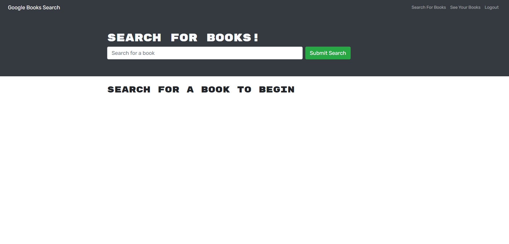

# Book Search Engine

## Description

This application a book search engine refactored from REST-ful API to running on MERN. It allows users to search for books using google search, then save them in a Mongo Atlas database. To test out the site, please use the following credentials:
```
email: test@test.com
password: testtest
```
Alternatively, feel free to sign up with your own credentials.

## Table of Contents

- [Installation](#installation)
- [Usage](#usage)
- [Credits](#credits)
- [License](#license)
- [Tests](#tests)

## Installation

This application has been deployed to Heroku and does not require any installation to work

## Usage

The application has been tested to work. Use the above credentials to test out the site or sign up. The following image shows the site's appearance on load.



## Contributors

Here is a list of contributors to this application:

N/A

## License

N/A

## Tests

N/A

## Questions

Here are two links to reach out to me:

Github: https://github.com/Honsumal

Email: 14leealastair@gmail.com